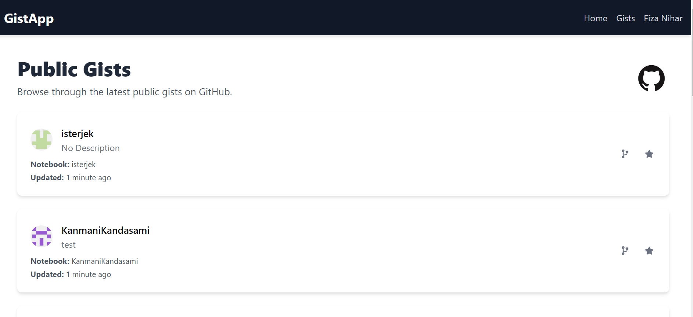
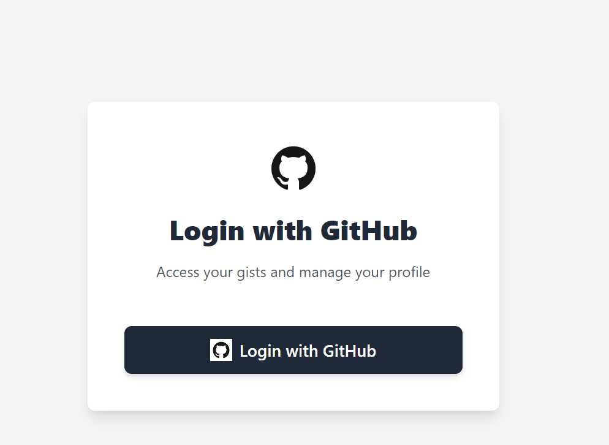
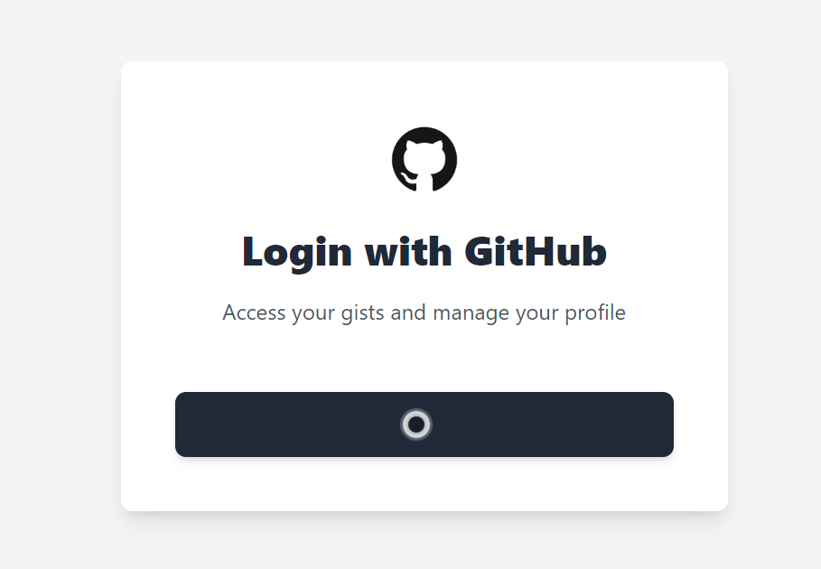
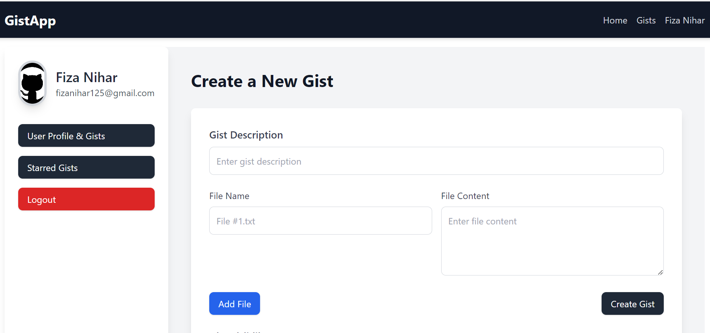
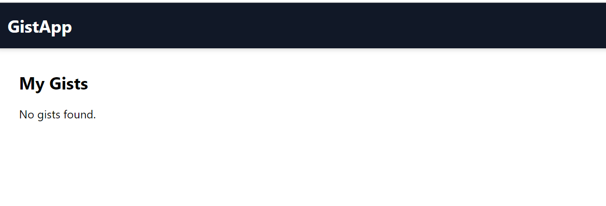
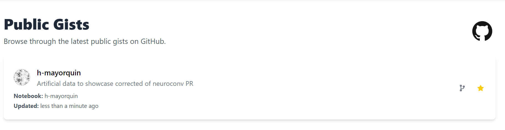
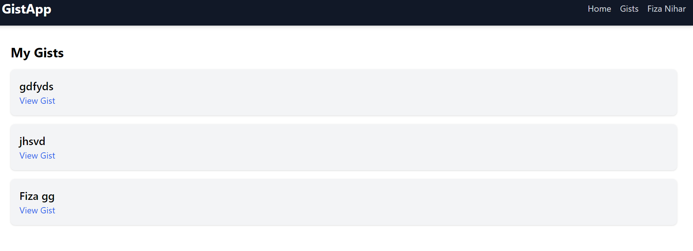
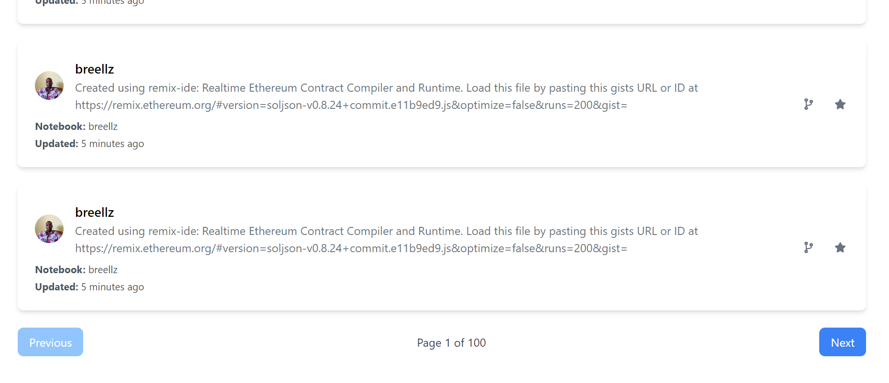

# GistApp

## Overview

GistApp is a web application that allows users to browse, create, and manage GitHub gists. It integrates GitHub authentication for user login and Appwrite for managing gists. The app provides functionalities for creating gists, starring gists, forking gists, and viewing user-specific and public gists.

## Features

- **GitHub Authentication**: Users can log in using their GitHub accounts.
- **Public Gists**: View and interact with public gists from GitHub.
- **User Gists**: Manage gists created by the logged-in user.
- **Star Gists**: Star and view gists that a user has starred.
- **Fork Gists**: Create a new gist based on an existing one.
- **Responsive Design**: Mobile-friendly user interface with a clean and modern design.

## Technologies Used

- **React**: Frontend library for building user interfaces.
- **Redux**: State management for handling authentication and user data.
- **Tailwind CSS**: Utility-first CSS framework for styling.
- **Appwrite**: Backend service for managing gists and user data.
- **GitHub API**: For fetching public gists and GitHub authentication.

## Installation

To set up the project locally, follow these steps:

1. **Clone the Repository**

    ```bash
    git clone https://github.com/your-username/gistapp.git
    cd gistapp
    ```

2. **Install Dependencies**

    ```bash
    npm install
    ```

3. **Set Up Environment Variables**

    Create a `.env` file in the root directory of the project and add the following environment variables:

    ```env
    VITE_APPWRITE_URL=your_appwrite_endpoint
    VITE_APPWRITE_PROJECT_ID=your_appwrite_project_id
    VITE_APPWRITE_DATABASE_ID=your_appwrite_database_id
    VITE_APPWRITE_COLLECTION_ID=your_appwrite_collection_id
    ```

4. **Start the Development Server**

    ```bash
    npm run dev
    ```

    Navigate to `http://localhost:5174` to view the application.

## Components

### `Header`

A responsive header with navigation links and a user profile dropdown.

- **Links**: Home, Gists, Profile, Logout
- **Dropdown Menu**: Access user profile and logout.

### `LoginPage`

The login page where users can authenticate using their GitHub accounts.

- **GitHub Login Button**: Initiates GitHub login.
- **Error Handling**: Displays login errors.

### `LandingPage`

The landing page showcasing public gists with pagination.

- **Gist List**: Displays a list of public gists fetched from GitHub.
- **Pagination**: Allows navigation through pages of gists.

### `ProfileGistsPage`

Displays gists created by the currently logged-in user.

- **User Gists**: List of gists created by the user.
- **UI**: Clean and organized display of gists.

### `GistDetail`

Component to show detailed information about a single gist.

- **Description**: Brief about the gist.
- **Links**: View the gist on GitHub.

## API Integration

### GitHub API

- **Endpoint**: `https://api.github.com/gists/public`
- **Usage**: Fetch public gists for displaying on the landing page.

### Appwrite

- **Functions**:
  - `createGist()`: Create a new gist.
  - `getPublicGists()`: Fetch public gists.
  - `getUserGists(userId)`: Fetch gists created by a specific user.
  - `starGist(gistId)`: Star a gist.
  - `forkGist(gistId)`: Fork an existing gist.
  - `getStarredGists()`: Fetch gists starred by the current user.
  - `deleteGist(gistId)`: Delete a gist.


## Acknowledgements

- **GitHub**: For providing the gists API.
- **Appwrite**: For the backend-as-a-service functionality.
- **Tailwind CSS**: For the utility-first CSS framework.

### Public Gists


### Login Page


### Login Page


### User Profile


### User Gists


### Starred


### User Gists


### Public Gists

